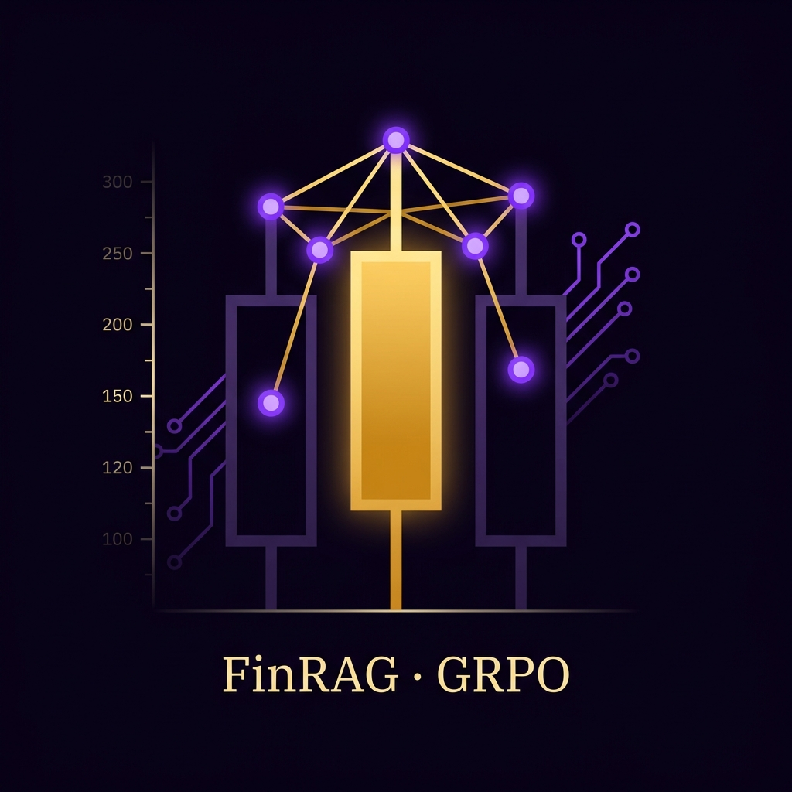

<!-- PROJECT LOGO -->
<br />
<div align="center">
  <a href="https://github.com/ChaoyuWang04/FinRAG-GRPO">
    
  </a>

<h3 align="center">FinRAG-GRPO</h3>

<p align="center">
  A GRPO training pipeline for reasoning reward modeling on Chinese customer-service preference data.
  <br /><br />
  | <a href="https://huggingface.co/datasets/SamWang0405/FinRAG-GRPO">🤗 HuggingFace Dataset</a> |
  <a href="https://github.com/ChaoyuWang04/FinRAG-GRPO/issues/new?labels=bug">Report Bug</a> |
  <a href="https://github.com/ChaoyuWang04/FinRAG-GRPO/issues/new?labels=enhancement">Request Feature</a> |
</p>

</div>


<!-- ABOUT THE PROJECT -->
## About The Project

FinRAG-GRPO is an open-source training pipeline for **Reasoning Reward Models (ReasRM)** built around **GRPO** fine-tuning. Instead of directly predicting a scalar reward, the model is trained to first produce an explicit judging process and then output a final pairwise preference between two candidate responses.

This repository currently focuses on **Chinese customer-service preference modeling**:

| Component | Description |
|--------|-------|
| Synthetic data generation | Multi-threaded generation of customer-service A/B preference data |
| Data format | JSONL with `context_messages` and `winner` |
| Task style | Pairwise preference judgment for customer-service answers |
| Training method | GRPO / PPO-style RL training with veRL + Ray + vLLM |
| Reward function | Rule-based match on the final `<answer>[[A/B]]</answer>` tag |
| Inference demo | Hugging Face model loading and single-example evaluation |
| Data files included | Raw shards, merged train/test, and `_with_sys` variants |

The current workflow in this repo is:

1. Generate synthetic customer-service preference samples.
2. Merge and split them into train/test JSONL files.
3. Optionally inject a Chinese system prompt for rubric-style judging.
4. Train a reasoning reward model with GRPO.
5. Export the FSDP checkpoint and run local inference.


### Built With

[![Python][Python-badge]][Python-url]
[![Ray][Ray-badge]][Ray-url]
[![vLLM][vLLM-badge]][vLLM-url]
[![Transformers][Transformers-badge]][Transformers-url]
[![HuggingFace][HuggingFace-badge]][HuggingFace-url]


<!-- GETTING STARTED -->
## Getting Started

### Prerequisites

- Python 3.11 recommended
- Conda
- CUDA-capable GPUs for training
- [veRL](https://github.com/volcengine/verl) on a pinned commit
- [vLLM](https://github.com/vllm-project/vllm) on a pinned commit
- `flash-attn==2.7.2.post1` recommended for faster training

For the exact environment notes used in this repo, see `README_zh.md`.

### Installation

1. Clone the repo
   ```sh
   git clone https://github.com/ChaoyuWang04/FinRAG-GRPO.git
   cd FinRAG-GRPO
   ```

2. Create a Python environment
   ```sh
   conda create -n rm-r1-1 python=3.11 -y
   conda activate rm-r1-1
   ```

3. Install veRL at the pinned commit
   ```sh
   git clone https://github.com/volcengine/verl
   cd verl
   git checkout e49fb572bf85a8f0ef7124c898f509bd6d9832a1
   pip install -e .
   cd ..
   ```

4. Install vLLM at the pinned commit
   ```sh
   git clone https://github.com/vllm-project/vllm.git
   cd vllm
   git checkout ed6e9075d31e32c8548b480a47d1ffb77da1f54c
   git cherry-pick caac5c2e597b1780c3df54a537c34e6061c32cff
   export VLLM_COMMIT=ed6e9075d31e32c8548b480a47d1ffb77da1f54c
   export VLLM_PRECOMPILED_WHEEL_LOCATION=https://wheels.vllm.ai/ed6e9075d31e32c8548b480a47d1ffb77da1f54c/vllm-1.0.0.dev-cp38-abi3-manylinux1_x86_64.whl
   VLLM_USE_PRECOMPILED=1 pip install --editable .
   cd ..
   ```

5. Install flash-attention
   ```sh
   pip install flash-attn==2.7.2.post1 --no-build-isolation
   ```

6. Verify project structure
   ```
   FinRAG-GRPO/
   ├── demo/
   │   ├── convert_fsdp_to_hf.py
   │   ├── demo.ipynb
   │   └── demo.py
   ├── docs/
   │   └── note.md
   ├── images/
   │   └── logo.jpg
   ├── rm_r1/
   │   ├── dataset/
   │   │   └── mix_data/
   │   │       ├── customer_service_dataset_*.jsonl
   │   │       ├── train.jsonl
   │   │       ├── test.jsonl
   │   │       ├── train_with_sys.jsonl
   │   │       ├── test_with_sys.jsonl
   │   │       ├── preprocess_data.py
   │   │       ├── chat_prompt_chinese.py
   │   │       └── mix_data.py
   │   ├── scripts/
   │   │   └── RLVR/local/train_rm_r1_rlvr_dpsk_distilled_7b.sh
   │   └── verl/
   │       ├── trainer/
   │       ├── utils/
   │       └── workers/
   ├── generate_customer_service_data.py
   ├── merge_and_split_dataset.py
   ├── README.md
   ├── README_zh.md
   └── LICENSE
   ```


<!-- USAGE EXAMPLES -->
## Usage

The current pipeline can be understood as four stages:

**Stage 1 - Generate synthetic customer-service preference data**

`generate_customer_service_data.py` creates pairwise A/B samples for Chinese e-commerce customer-service scenarios.  
Note: this script imports `call_llm` from a local `llm` module, which is not included in this repository, so you need to provide your own LLM wrapper before running it.

```sh
python generate_customer_service_data.py
# Output: customer_service_dataset.jsonl
```

**Stage 2 - Merge and split dataset shards**

`merge_and_split_dataset.py` merges the raw JSONL shards, shuffles them with a fixed seed, and writes the final training and test sets.

```sh
python merge_and_split_dataset.py
# Output:
#   rm_r1/dataset/mix_data/train.jsonl
#   rm_r1/dataset/mix_data/test.jsonl
```

**Stage 3 - Inject the system prompt**

`preprocess_data.py` prepends the Chinese judging prompt to each sample and produces `_with_sys` variants for training and evaluation.

```sh
cd rm_r1/dataset/mix_data
python preprocess_data.py
# Output:
#   train_with_sys.jsonl
#   test_with_sys.jsonl
```

**Stage 4 - Launch GRPO training**

The training entrypoint is:

```sh
bash ./rm_r1/scripts/RLVR/local/train_rm_r1_rlvr_dpsk_distilled_7b.sh
```

The script configures:

- Ray startup and teardown
- model path and save path
- GRPO batch sizes and token limits
- custom reward loading from `rm_r1/verl/utils/reward_score/lm_as_judge.py`
- local JSONL train/validation files

Before running it, you will likely want to update the hard-coded paths inside the script, such as:

- `MODEL_PATH`
- `SAVE_META_DIR`
- `TRAIN_TASK`
- `EVAL_TASK`

**Optional - Convert FSDP checkpoints to a Hugging Face model**

```sh
python demo/convert_fsdp_to_hf.py
```

**Optional - Run the local inference demo**

```sh
python demo/demo.py
```


<!-- ROADMAP -->
## Roadmap

- [x] Synthetic Chinese customer-service pairwise preference data generation
- [x] Merge-and-split pipeline for JSONL reward-model data
- [x] Chinese rubric-style system prompt injection
- [x] Custom GRPO training entry based on veRL + Ray + vLLM
- [x] Rule-based reward matching for final A/B judgment tags
- [x] Local demo for checkpoint export and inference
- [ ] Replace hard-coded training paths with configurable arguments
- [ ] Use the `_with_sys.jsonl` files consistently in training and evaluation
- [ ] Improve the reward from sparse final-tag matching to denser structured scoring
- [ ] Add a cleaner evaluation pipeline and fixed benchmark split
- [ ] Improve FSDP checkpoint merging beyond the current rank-0-only shortcut

See the [open issues](https://github.com/ChaoyuWang04/FinRAG-GRPO/issues) for a full list of proposed features and known issues.


<!-- CONTRIBUTING -->
## Contributing

Contributions are what make the open source community such an amazing place to learn, inspire, and create. Any contributions you make are **greatly appreciated**.

If you have a suggestion that would make this better, please fork the repo and create a pull request. You can also simply open an issue with the tag "enhancement".
Don't forget to give the project a star! Thanks again!

1. Fork the Project
2. Create your Feature Branch (`git checkout -b feature/AmazingFeature`)
3. Commit your Changes (`git commit -m 'Add some AmazingFeature'`)
4. Push to the Branch (`git push origin feature/AmazingFeature`)
5. Open a Pull Request


### Top contributors:

<a href="https://github.com/ChaoyuWang04/FinRAG-GRPO/graphs/contributors">
  
</a>

<!-- LICENSE -->
## License

Distributed under the MIT License. See `LICENSE` for more information.


<!-- CONTACT -->
## Contact

Chaoyu Wang - [Linkedin](https://www.linkedin.com/in/samwang04/) - [PersonalWeb](https://chaoyuwang04.github.io/)

Project Link: [https://github.com/ChaoyuWang04/FinRAG-GRPO](https://github.com/ChaoyuWang04/FinRAG-GRPO)

Dataset Link: [https://huggingface.co/datasets/SamWang0405/FinRAG-GRPO](https://huggingface.co/datasets/SamWang0405/FinRAG-GRPO)


<!-- ACKNOWLEDGMENTS -->
## Acknowledgments

* [veRL](https://github.com/volcengine/verl) - training framework foundation
* [vLLM](https://github.com/vllm-project/vllm) - rollout and inference backend
* [Transformers](https://github.com/huggingface/transformers) - model loading and export utilities
* [Best-README-Template](https://github.com/othneildrew/Best-README-Template) - README structure


<!-- MARKDOWN LINKS & IMAGES -->
[contributors-shield]: https://img.shields.io/github/contributors/ChaoyuWang04/FinRAG-GRPO.svg?style=for-the-badge
[contributors-url]: https://github.com/ChaoyuWang04/FinRAG-GRPO/graphs/contributors
[forks-shield]: https://img.shields.io/github/forks/ChaoyuWang04/FinRAG-GRPO.svg?style=for-the-badge
[forks-url]: https://github.com/ChaoyuWang04/FinRAG-GRPO/network/members
[stars-shield]: https://img.shields.io/github/stars/ChaoyuWang04/FinRAG-GRPO.svg?style=for-the-badge
[stars-url]: https://github.com/ChaoyuWang04/FinRAG-GRPO/stargazers
[issues-shield]: https://img.shields.io/github/issues/ChaoyuWang04/FinRAG-GRPO.svg?style=for-the-badge
[issues-url]: https://github.com/ChaoyuWang04/FinRAG-GRPO/issues
[license-shield]: https://img.shields.io/github/license/ChaoyuWang04/FinRAG-GRPO.svg?style=for-the-badge
[license-url]: https://github.com/ChaoyuWang04/FinRAG-GRPO/blob/master/LICENSE
[linkedin-shield]: https://img.shields.io/badge/-LinkedIn-black.svg?style=for-the-badge&logo=linkedin&colorB=555
[linkedin-url]: https://www.linkedin.com/in/samwang04/

[Python-badge]: https://img.shields.io/badge/Python-3776AB?style=for-the-badge&logo=python&logoColor=white
[Python-url]: https://www.python.org/
[Ray-badge]: https://img.shields.io/badge/Ray-028CF0?style=for-the-badge&logo=ray&logoColor=white
[Ray-url]: https://www.ray.io/
[vLLM-badge]: https://img.shields.io/badge/vLLM-111111?style=for-the-badge
[vLLM-url]: https://github.com/vllm-project/vllm
[Transformers-badge]: https://img.shields.io/badge/Transformers-FFBF00?style=for-the-badge
[Transformers-url]: https://huggingface.co/docs/transformers
[HuggingFace-badge]: https://img.shields.io/badge/🤗%20HuggingFace-FFD21E?style=for-the-badge
[HuggingFace-url]: https://huggingface.co/
